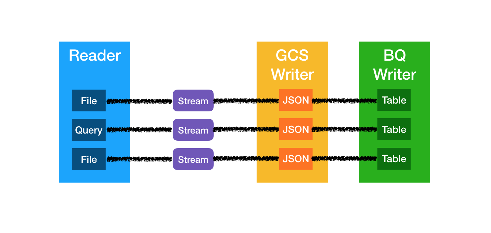

# nautilus-connectors-kit

Nautilus connectors kit is a tool which aim is getting raw data from different sources and store them as-is into GCS bucket as uncompressed JSON files. 
Finally files can be transfered to BigQuery tables for analysis purposes.

## Getting started

### Docker image

1. Build docker image from container registry (TODO Create dedicated project)
2. Build image and run
```shell
docker run [IMAGE] [COMMAND] [GCS WRITER OPTIONS] [BQ WRITER OPTIONS] [READER OPTIONS]
```

### Standalone

1. Clone repository and install dependencies
```shell
git clone git@github.com:artefactory/nautilus-connectors-kit.git
pip install -r requirements.txt
```

2. Application is now ready to use
```shell
python bin/app.py [COMMAND] [OPTIONS]
```

## Philosophy

NCK is divided in three main components : Readers, Streams, and Writers.

- [Readers](./lib/readers/README.md) role is to read data from distant sources and transform it into stream object
- [Streams](./lib/streams/README.md) role is to be read as file or line by line. There are local objects usable by writers
- [Writers](./lib/writers/README.md) role is to write stream into distant location

Current writing strategy : Stream objects are written as uncompressed JSON file on GCS and then duplicated as table into BigQuery tables.



## TODO

1. Documentation
2. Docker image
3. API READER
    3a. SAP
    3b. Salesforce
    3c. PYS
4. Append vs Replace (BQ Writer)
5. Disable BQ writing
5. Saver implementation (GCS, PostgreSQL)